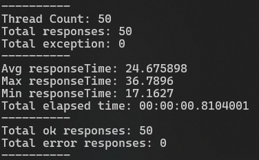
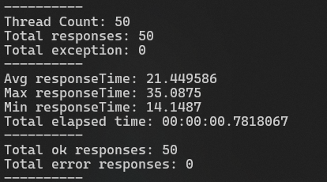
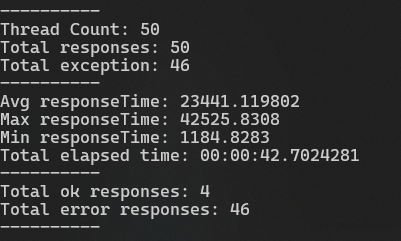
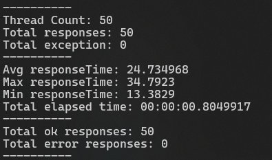
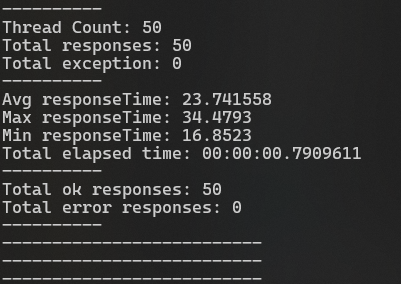
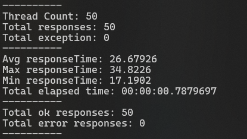
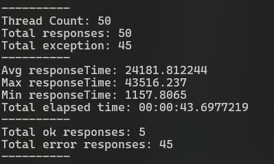
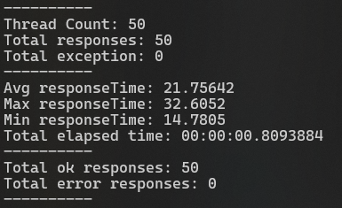

## Flurl Test for sync and async on old version and new version

---

we use .net framework 4.6.2 with flurl 2.4.2 and 4.0.2

---

### Flurl 2.4.2

#### Async


#### Async with `ConfigureAwait(false)`


#### Sync 


#### Sync with `ConfigureAwait(false)`


---

### Flurl 4.0.2

#### Async


#### Async with `ConfigureAwait(false)`


#### Sync


#### Sync with `ConfigureAwait(false)`


---

### Result

On both new and old version if we use sync like bellow code we get time out.  
Also `WithTimeout` not work on this code


```csharp
return _baseHttpAddress
        .WithHeaders(headers)
        .WithTimeout(TimeSpan.FromSeconds(TimeOutOnSecond))
        .AppendPathSegment(url)
        .SetQueryParams(query)
        .GetJsonAsync<TResponse>()
        .GetAwaiter().GetResult();
```

If add `ConfigureAwait(false)` problem will be solved.  

```csharp
return _baseHttpAddress
        .WithHeaders(headers)
        .WithTimeout(TimeSpan.FromSeconds(TimeOutOnSecond))
        .AppendPathSegment(url)
        .SetQueryParams(query)
        .GetJsonAsync<TResponse>()
        .ConfigureAwait(false).GetAwaiter().GetResult();
```